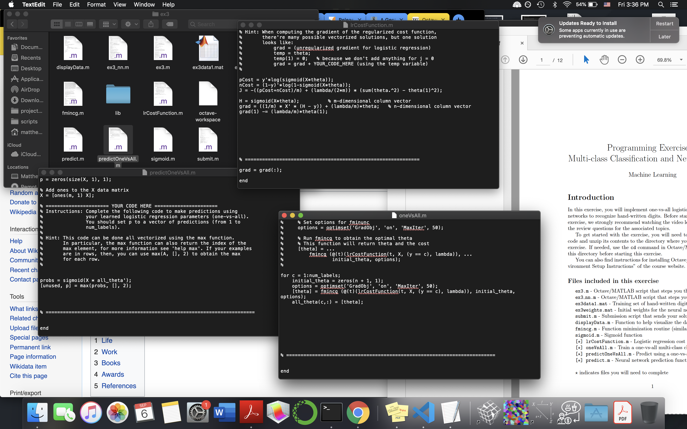

# Flower Power!

I recently finished Andrew Ng's famous [machine learning course](https://coursera.org/learn/machine-learning). I gained a fundamental understanding of a variety of ML topics, but I left the course thinking, "Wait, so how do people actually *use* these things?" To answer this question, I decided to try my hand at running logistic regression on the ever-so-popular<sup>[1]</sup> [iris data set](https://en.wikipedia.org/wiki/Iris_flower_data_set) using scikit-learn, a free Python machine learning library. Read on to find out what I learned!

## Exploring the Docs

I initially thought that this project was going to be pretty similar to the assignments in Andrew's course where I implemented various machine learning algorithms in Octave. I would ponder the algorithm in an abstract sense, then try to efficiently translate it into code. Making sure my implementation worked properly was a slow and fiddly process, riddled with missing semicolons and botched matrix operations. You really had to know what your code was doing. Turns out, with scikit-learn, you don't need to know what you're doing at all!

Just kidding (kinda). Going through that course was definitely a valuable experience, but a quick tour of the scikit-learn documentation made me realize that *all the hard stuff was already done for me*. Example: My work for Andrew's one-vs-all logistic regression assignment was a jank collection of scripts written in TextEdit because I was too lazy to find a better editor.



I did the same thing with scikit-learn in two lines.

```python
from sklearn.linear_model import LogisticRegression
classifier = LogisticRegression(penalty="l2", C=1.0, solver="lbfgs", multi_class="ovr")
```

The `LogisticRegression` constructor has tons of optional arguments, of which I chose four: `penalty="l2"` specified a certain regularization scheme,<sup>[2]</sup> `C=1.0` set the inverse of regularization strength,<sup>[3]</sup> `solver="lbfgs"` meant that the classifier used the [limited-memory Broyden-Fletcher-Goldfarb-Shanno algorithm](https://en.wikipedia.org/wiki/Limited-memory_BFGS), which seems to be some hella fancy version of gradient descent, and `multi_class="ovr"` meant one-versus-rest. These two lines were all I needed to create a fully-functional logistic regression classifier. All the fiddly implementation details had already been figured out and hidden away!

It became clear that I didn't need to reinvent the wheel–I simply needed to choose a few from a massive library of ready-made wheels.

## Reading in the Data

Before the wheel shopping could begin, however, I needed to gather my data and make it compatible with scikit-learn. I started with the `iris.data` file from the [UCI Machine Learning Repository](https://archive.ics.uci.edu/ml/index.php). The file contained 150 rows of data, where each row consisted of four flower features (sepal length, sepal width,petal length, petal width) and a class (one of three iris species).

```
5.1,3.5,1.4,0.2,Iris-setosa
4.9,3.0,1.4,0.2,Iris-setosa
...
5.5,2.6,4.4,1.2,Iris-versicolor
6.1,3.0,4.6,1.4,Iris-versicolor
...
6.7,2.5,5.8,1.8,Iris-virginica
7.2,3.6,6.1,2.5,Iris-virginica
...
```

I saved the first four columns of the data in a 150-by-4 numpy array called `features.npy`, and I stored the fifth column in a 150-by-1 numpy array called `classes.npy`.

```python
import numpy
X = numpy.loadtxt("iris.data", delimiter=",", usecols=(0,1,2,3))
y = numpy.loadtxt("iris.data", delimiter=",", usecols=(4), dtype="str")
numpy.save("features", X)
numpy.save("classes", y)
```

Then, while skimming the docs, I discovered that the iris data set is *literally built into scikit-learn*.

```python
from sklearn import datasets
iris = datasets.load_iris()
```

Sigh. Moving on then.

## Training Methodology

As is tradition, I wanted to train my classifier on one portion of the data and test its performance on another. This is because I wanted to see how well my classifier captures the underlying behavior of irises at large, not the idosyncracies of data I trained with. If I trained and tested on the same data, there would be no way to tell if my classifier was *overfitted*, i.e., capturing a lot of idosyncracies and obscuring the correct underlying behavior. The `train_test_split` function was a super easy way to randomly split up the data into a training set and a test set using any proportion I wanted. In this case, I saved 30% of the data for testing.

```python
from sklearn.model_selection import train_test_split
X_train, X_test, y_train, y_test = train_test_split(X, y, test_size=0.3)
```

Keen to try out more techniques from Andrew's course, I wanted to run the classifier with a bunch of different `C` values and see which one is the best. But again, I couldn't check the performance of a `C` value by testing on the same data I trained with. The way this was dealt with in the course was by making a *cross-validation set*, to be used only for comparing different regularization strengths. I found a better way in scikit-learn's `cross_val_score`, which does a fancy thing called [*k-fold validation*](https://scikit-learn.org/stable/modules/cross_validation.html).

```python
from sklearn.model_selection import cross_val_score
scores = cross_val_score(classifier, X_train, y_train, cv=5)
interval = "%0.3f (+/- %0.3f)" % (scores.mean(), scores.std() * 2)
```

By setting `cv=5`, we tell the computer to train our classifier five times on five different training/cross-validation splits, or "folds". The accuracy acheived on each fold is recorded in `scores` as floats between 0 and 1, with 1 meaning 100% accurate. (The way the folds are determined and the exact meaning of "accurate" depend on a variety of factors; see the above link.) From `scores` we can easily construct a 95% confidence interval for accuracy.

## Training Time!

I made the `flowerpower.py` script to bring together everything that I've talked about.

```
$ python flowerpower.py 0.01 100 1000000

Cross-Validation Scores:
1 0.731 (+/- 0.117)
2 0.942 (+/- 0.042)
3 0.952 (+/- 0.063)

Enter a row number: 2
Final Score: 0.978
```

It takes any number of `C` values as command-line arguments and computes their cross-validation scores. Then it calculates a final score using a `C` value that you choose, in this case the second one we input, or `C=100`.

## What Does It Mean??

The above results tell us that our classifier performs really well, so long as `C` isn't too small. This means that our data fits a simple pattern really well and is not very susceptible to overfitting. The script then

---

1. It's so popular, it tops Wikipedia's [list of classic data sets](https://en.wikipedia.org/wiki/Data_set#Classic_data_sets)–because of course such a thing exists.

2. L2 regularization is what I saw in Andrew's course, so I chose it out of familiarity. The precise difference in behavior between L1 regularization and L2 regularization remains a mystery to me.

3. Why inverse? Nobody knows.
